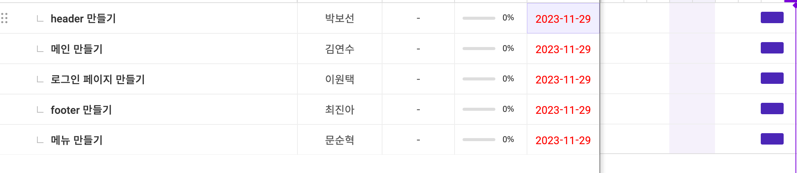

## ▶️ 프로젝트 명

### 데이지크(Dasique) 클론코딩

<a href="https://www.dasique.co.kr/" target="_blank">원본 사이트 링크</a>  <a href="https://pt-coding-club.github.io/pt-coding-dasique/" target="_blank">최종 결과물 링크</a>

## ▶️ 프로젝트 소개

- 데이지크(Dasique) 사이트를 메인페이지를 기준으로 기능별로 나누어 구현
- branch를 나누어 각자 맡은 ui와 기능을 구현

## ▶️ 개발 기간

##### 2023.11.28 - 2023.12.1

## ▶️ 개발자 소개

> 김연수

- 메인(main-screen)
- 화면 수직 scroll 기능(버튼 클릭, 마우스 스크롤)
- 현재 어디에 위치하고 있는지 확인할 수 있는 원 모양의 버튼 생성
- 눈 내리는 효과(snow-flake)
  - transition, setTimeout, keyframe

> 문순혁

- menu 세부 페이지 생성
- shop.html
- about.html

> 이원택

> 박보선

- 헤더(header)
- 메뉴 hover 사이드 메뉴 보이게
- 메뉴 hover transition 효과
- 글씨체(font) 삽입

> 최진아

- 바닥글(footer)
- 카카오톡 간편 로그인 구현(kakao developer API)

## ▶️ 개발환경

- IDE : VS Code
- Javascript, Html, Css
- 버전 관리: github
- 협업 tool : [flow](https://flow.team/kr/index)  
- 소통 : discord, zoom
